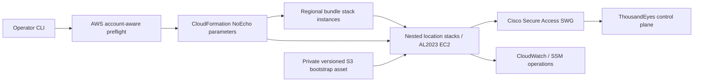

# Cisco Secure Access SWG AWS ThousandEyes Monitor

Deploy one Cisco ThousandEyes Enterprise Agent near each selected Cisco Secure Access Secure Web Gateway (SWG) location. A Python orchestrator discovers account-specific AWS Region and Local Zone availability and performs one self-managed CloudFormation StackSet rollout across all required parent Regions. Each location is associated with a dedicated, permanent Elastic IP that an operator manually registers as a Cisco Secure Access Network; the host verifies the SWG proxy is reachable through that trusted identity before it installs and registers the agent.

> The generated local configuration contains deployment credentials, is written mode `0600`, and is ignored by Git. CloudFormation receives them as `NoEcho` parameters. Do not commit or share generated configuration files.

## Architecture



The StackSet creates one regional bundle stack instance in each selected parent Region. Each bundle creates up to four nested location stacks, which is necessary because a StackSet can have only one stack instance per account/Region while several target cities share `us-east-1` or `us-west-2`. See [docs/architecture.md](docs/architecture.md) for lifecycle and permission tradeoffs.

## Supported location intents

| Operator location | AWS target intent | Classification |
|---|---|---|
| Northern Virginia | `us-east-1` | Region |
| Ohio | `us-east-2` | Region |
| Miami | group `us-east-1-mia-2` | Local Zone; account opt-in/access required |
| Dallas | group `us-east-1-dfw-2` | Local Zone; account opt-in/access required |
| Denver | group `us-west-2-den-1` | Local Zone; account opt-in/access required |
| Oregon | `us-west-2` | Region |
| San Jose | `us-west-1` | Northern California Region; validate latency to San Jose |
| Los Angeles | group `us-west-2-lax-1` | Local Zone; account opt-in/access required |

The groups are discovery hints, not hard-coded zone names. `validate` calls `DescribeAvailabilityZones` with `AllAvailabilityZones`, requires `State=available` and, for Local Zones, `OptInStatus=opted-in`, then confirms the selected instance type is offered in the resolved zone. A missing or restricted zone produces an actionable error; CloudFormation is never expected to enable it.

## Prerequisites

- Python 3.11 or newer.
- AWS credentials able to call STS, EC2 discovery and Elastic IP management, SSM public parameters, CloudFormation, S3, IAM, and the resources in the template.
- A Cisco Secure Access PAC URL reachable only from source IPs registered as Secure Access Networks.
- ThousandEyes Account Group Installation Token.
- Local Zone opt-in completed in **EC2 > Settings > Zones**. Restricted locations may require AWS Support.
- An existing EC2 key pair in every parent Region only when SSH is enabled. Session Manager is the default.
- After each deployment prints its resolved Elastic IPs, manually register each one as a Registered Network in the Cisco Secure Access GUI; there is no supported API for this step (see **Bootstrap gate**).

Amazon Linux 2023 is resolved through the AWS public SSM parameter, never an AMI ID. ThousandEyes currently documents AL2023 x86-64 as supported. Automatic deployment checks each exact zone and selects the first offered type from `t3.small`, `t3.medium`, and `t2.medium`. It never falls back to a large instance. Manual templates for Dallas and Miami default to `t3.medium`. If EC2 offering discovery returns no affordable match, automatic deployment warns and attempts `t3.medium`; the actual CloudFormation instance launch is the final availability check. The encrypted root gp2 volume is 20 GiB. BrowserBot is disabled by default.

## Install for development

```bash
python3 -m venv .venv
source .venv/bin/activate
python -m pip install -e '.[dev]'
```

## Configuration

Interactive configuration presents one multi-select checklist: arrow keys move, Space toggles, and Enter confirms. After collecting the deployment values, it asks whether to generate standalone CloudFormation template files for manual deployment or configure AWS immediately.

Resource and agent names are generated automatically from each selected AWS Region or Local Zone; the workflow does not prompt for a naming prefix or environment.

```bash
swg-te-monitor configure --output config.local.yaml
```

Choose **Generate CloudFormation template file for manual deployment** to write `generated/cloudformation.yaml` without making any AWS API calls. If multiple locations are selected, one suffixed template is written per location. This choice is saved in the configuration, and a later `deploy` command refuses to contact AWS for a manual-only configuration. Choose **Deploy to AWS with this CLI** to record that intent in the configuration.

`configure` only writes the configuration; it never contacts AWS or deploys. Review the saved file, then deploy with the commands below.

Automatic deployment uses the AWS Python SDK (`boto3`), not AWS CLI subprocesses. It reads the same named profiles and cached IAM Identity Center/SSO sessions as the AWS CLI. Select the organization SSO profile when prompted and authenticate first with `aws sso login --profile <profile>` if its cached session has expired.

Generated templates contain the supplied credentials as `NoEcho` parameter defaults and are written mode `0600` under the Git-ignored `generated/` directory. Treat them as secrets. The bootstrap program is embedded in each generated template, so manual deployment does not require an S3 bootstrap upload.

Secret prompts are hidden. The command writes the values to a mode `0600`, Git-ignored local configuration and does not use AWS Secrets Manager.

For CI, copy `config.example.yaml`, replace all placeholders, and keep the resulting file outside Git.

## Preflight and deployment

```bash
swg-te-monitor validate --config config.local.yaml
swg-te-monitor deploy --config config.local.yaml --dry-run
swg-te-monitor deploy --config config.local.yaml
swg-te-monitor status --config config.local.yaml
```

After resolving each location's Elastic IP and before provisioning anything, `deploy` prints the addresses and pauses:

```text
Confirm that each EIP is provisioned as a Registered Network in Cisco Secure Access.
Press Return to continue when this has been manually configured.
```

Register any newly allocated address in Cisco before continuing; an instance that boots first fails its proxy check and takes its stack down with it. `--yes` skips the pause for addresses already registered, and a run with no attached console warns and proceeds rather than blocking. `--dry-run` allocates nothing, so it cannot be used to discover a new location's address in advance.

Only the locations listed in the configuration are deployed. Any other location already deployed in the same Region is carried through untouched, down to its bootstrap asset, so adding one location neither replaces nor deletes another. Listing a running location again *does* refresh it, which replaces its instance if the bootstrap program has changed since it booted.

Preflight verifies credentials, Region/Local Zone status, instance-type offering, AL2023 public AMI resolution, and regional SSH key existence. Quota, CIDR-overlap, comprehensive IAM simulation, and secret replication across Regions remain account-dependent checks; see **Limitations**.

Deployment uploads the reviewed location template and bootstrap script to private, encrypted, account/Region-specific S3 buckets under SHA-256 content-addressed keys. It reuses the standard same-account self-managed StackSet administration and execution roles when both already exist; otherwise it creates them through the permission stack. If only one role exists, deployment stops with a clear missing-role error instead of attempting a conflicting partial stack. It then creates or updates one StackSet, applies Region-specific parameter overrides, and waits for every stack instance. EC2 verifies the bootstrap digest before execution.

Before StackSet preflight, deployment creates or updates an inline Lambda-backed custom resource that opts the account into every selected Local Zone group and waits for an available zone. The script warns that this step may take several minutes. The function uses 128 MiB ARM64 on-demand Lambda execution only during stack create/update; it has no provisioned concurrency or schedule, retains logs for seven days, and intentionally does not opt out during deletion. Locations restricted by AWS Support fail with an actionable stack event.

## Bootstrap gate

Each location's Elastic IP is the trust identity: it must be manually registered as a Registered Network in Cisco Secure Access before the SWG proxy will serve that instance. No supported Cisco API automates this step; it must be completed in the Cisco Secure Access GUI after the CLI prints the resolved EIP for each location and before installation succeeds.

The idempotent bootstrap performs these phases and records only redacted state in `/var/lib/swg-te-monitor/status.json`:

Before the bootstrap program runs, user data associates that Elastic IP over the subnet's auto-assigned public address and waits until IMDSv2 reports the expected address. The auto-assigned address exists only to give the host enough connectivity to call `ec2:AssociateAddress`; nothing that Cisco Secure Access evaluates egresses before the swap completes. See [docs/architecture.md](docs/architecture.md) for why the association is not a CloudFormation resource.

1. Read credentials supplied through CloudFormation `NoEcho` parameters from the root-only bootstrap configuration; set the deterministic hostname.
2. Read the public IPv4 from IMDSv2 and record only a hash of it.
3. Confirm the SWG proxy is reachable by fetching the PAC over verified HTTPS, retrying 3 times 5 seconds apart; reject downgrade redirects, oversized/empty content, unexpected MIME types, and content without `FindProxyForURL`. If still unreachable after all attempts, bootstrap fails with: "The SWG proxy is not reachable. Please check that each EIP is provisioned as a Registered Network in Cisco Secure Access."
4. Download the official ThousandEyes installer and perform batch PAC installation.
5. Enable/start `te-agent.service` and confirm it is active.

Any failure disables and stops `te-agent.service`, records a redacted diagnostic, exits nonzero, and causes CloudFormation signaling to fail. There is no unbounded boot loop.

## SSH and access

Session Manager is the default and the security group has no inbound rule. The configuration prompt asks for `Authorized SSH IP (blank for SSH disabled):`. Leaving it blank disables SSH. Supplying one IPv4 address enables TCP/22 only from that address as a `/32` rule and then asks for the existing regional EC2 key-pair name.

```bash
aws ssm start-session --target <INSTANCE_ID> --region <PARENT_REGION>
```

Private keys are never generated or handled by this project.

## Operations

Run these on the instance through Session Manager:

```bash
sudo systemctl restart te-agent.service
curl --fail --silent --show-error --max-time 10 https://checkip.amazonaws.com/
sudo /usr/local/sbin/swg-te-bootstrap
sudo cat /var/lib/swg-te-monitor/status.json
sudo systemctl status te-agent.service
```

Do not enable shell tracing or print the root-only bootstrap configuration, the PAC response, or installer arguments. The vendor installer requires its token as an argument, creating a brief local process-list exposure; default SSM-only access minimizes that window.

## Monitoring and troubleshooting

- `FAILED` before `proxy-reachable`: the instance's Elastic IP is most likely not yet (or no longer) registered as a Cisco Secure Access Network. Confirm the EIP printed by `deploy` is registered in the Cisco Secure Access GUI.
- PAC failure: verify the EIP's Registered Network status, TLS chain, redirects, content type, and that the response is a PAC rather than an authentication page.
- Agent remains stopped: this is deliberate fail-closed behavior. Fix the earlier phase, then rerun `/usr/local/sbin/swg-te-bootstrap`.
- CloudFormation timeout: inspect the instance through SSM and the redacted status file. Stack events contain no secret values.

## Storage and lifecycle

The agent uses a 20 GiB encrypted gp2 root volume, satisfying the documented total disk minimum. It is deleted with the instance. The project deliberately does not advertise detached-volume agent migration: ThousandEyes agent identity reuse on a different host is not documented here as supported. Back up configuration references, not registered agent state; replace and re-register through the supported installer workflow.

## Teardown

```bash
swg-te-monitor remove --config config.local.yaml --yes
```

Removal deletes all regional stack instances and then the StackSet. The StackSet permission stack, content-addressed S3 assets, and buckets are intentionally retained. Review and remove them only after confirming no deployment consumes them.

## Security and threat model

See [docs/threat-model.md](docs/threat-model.md). Principal controls include IMDSv2, least-privilege secret/object reads, encrypted EBS and S3, no public S3 access, restricted/no SSH, fail-closed registration, TLS validation, deterministic assets, redacted status, and secret-scanning CI.

## Cost considerations

Each location uses an On-Demand EC2 `t3.small` and incurs 20 GiB gp2 EBS, one Elastic IP, data transfer, S3, CloudWatch/SSM usage, and potentially Local Zone premiums. ThousandEyes licensing is separate. StackSets and CloudFormation stacks have no separate stack charge. Check current regional and Local Zone pricing before deployment.

Elastic IPs are allocated once per location (tag-matched by agent hostname) and are never released by this tool, even on `remove`, because they are registered as Cisco Secure Access Networks and releasing one would silently break that location's SWG trust and risks AWS reassigning the address to another account. Review and release unused Elastic IPs manually if a location is permanently retired.

## Validation and development

```bash
ruff check .
ruff format --check .
mypy src
pytest
cfn-lint infrastructure/*.yaml
bandit -r src bootstrap
git grep -nEi '(BEGIN .*PRIVATE KEY|password\s*=|token\s*=|passphrase\s*=)'
```

CI runs Python tests/lint/type checks, `cfn-lint`, Bandit, and Gitleaks. No live AWS, Cisco, or ThousandEyes deployment occurs in CI.

## Limitations and integration tests required

- Cisco Secure Access Network registration is a manual, GUI-only step per Elastic IP; there is no supported API to automate it. `deploy` pauses for that registration before provisioning, but cannot verify it.
- Deterministic Linux hostname is used for the requested agent name and to tag-match each location's Elastic IP. Confirm the resulting display name in ThousandEyes; a post-registration API rename is not attempted because no ThousandEyes API bearer credential is collected.
- The CLI does not yet simulate every IAM permission, inspect VPC CIDR overlap across all VPCs, or query every service quota.
- CloudWatch agent installation/log shipping is not enabled in the initial release; SSM and systemd journal are the diagnostic path.
- Integration acceptance requires real AWS, Cisco Secure Access, and ThousandEyes credentials and was not performed by static tests.

## Project structure

```text
bootstrap/                 Fail-closed host bootstrap
docs/                      Architecture and threat model
infrastructure/            Reusable regional CloudFormation template
src/swg_te_monitor/        CLI, models, discovery, orchestration, UI
tests/                     Unit and mocked decision tests
config.example.yaml        Placeholder-only non-secret example
```

## Contributing

Create a feature branch, add tests for behavior and failures, run all validation commands, and never commit local configuration or credentials. Changes to cryptography, identity, routing, installer flags, or secret handling require current official vendor references and an integration-test note.

## Official references

- [AWS available Local Zones](https://docs.aws.amazon.com/local-zones/latest/ug/available-local-zones.html)
- [AWS Local Zone opt-in](https://docs.aws.amazon.com/local-zones/latest/ug/opt-in-local-zone.html)
- [AWS public AMI SSM parameters](https://docs.aws.amazon.com/AWSEC2/latest/UserGuide/finding-an-ami-parameter-store.html)
- [Amazon Linux 2023 on EC2](https://docs.aws.amazon.com/linux/al2023/ug/ec2.html)
- [ThousandEyes Enterprise Agent requirements](https://docs.thousandeyes.com/product-documentation/global-vantage-points/enterprise-agents/installing/enterprise-agent-system-requirements)
- [ThousandEyes Linux package deployment](https://docs.thousandeyes.com/product-documentation/global-vantage-points/enterprise-agents/installing/linux-packages/enterprise-agent-deployment-using-linux-package-method)
- [ThousandEyes proxy installation](https://docs.thousandeyes.com/product-documentation/global-vantage-points/enterprise-agents/proxy/installing-enterprise-agents-in-proxy-environments)
